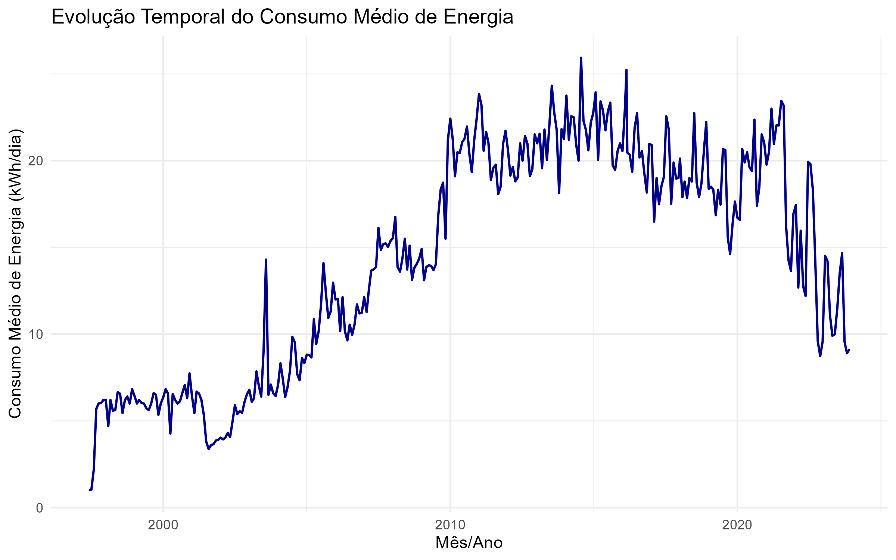
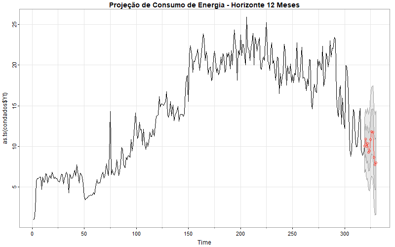

Análise e Previsão de Séries Temporais - Modelo SARIMA
================
Mateus Vieira Costa

# Modelagem SARIMA para Previsão de Consumo de Energia Elétrica

Este repositório contém o arcabouço estatístico desenvolvido para a
disciplina de Análise de Séries Temporais da Universidade de Brasília
(UnB). O projeto foca no desenvolvimento de um pipeline preditivo ponta
a ponta (*Forecasting*) para modelar o consumo médio de energia elétrica
utilizando dados históricos mensais de junho de 1997 a maio de 2024 (324
observações).

## 🛠️ Tecnologias e Ferramentas Utilizadas

- **Linguagem Principal:** R
- **Modelagem e Diagnóstico:** `astsa`, `forecast`, `TSA`, `aTSA`
- **Manipulação e Visualização:** `tidyverse`, `dplyr`, `ggplot2`, `zoo`

## 📊 Engenharia de Atributos & Análise de Estacionaridade

O desenho metodológico do projeto seguiu rigorosamente as etapas de
modelagem da escola Box-Jenkins: \* **Engenharia de Recursos:**
Transformação do consumo total de energia pelo número de dias do mês
regulamentar ($Y_t = X_t / D_t$) para estabilizar a variabilidade e
isolar uma taxa pura de consumo médio diário. \* **Teste de Raiz
Unitária:** Aplicação do Teste de Dickey-Fuller Aumentado (`adf.test`)
para comprovar a não-estacionaridade na série original através do
decaimento lento da Função de Autocorrelação (FAC). \* **Remoção de
Tendência:** Aplicação de uma primeira diferenciação regular ($d=1$),
transformando a série em estacionária e habilitando o ajuste do modelo
de forma rigorosa.

## 🧠 Abordagem Estatística: Busca em Malha Automatizada

Para a identificação da ordem ótima do modelo preditivo, foi
desenvolvido um algoritmo de **Grid Search (Busca em Malha)**. O script
testa dezenas de combinações concorrentes para as ordens
autorregressivas ($p$, $P$) e de médias móveis ($q$, $Q$), avaliando a
parte regular e sazonal ($s=12$).

O critério de seleção do melhor modelo foi a minimização do Critério de
Informação Bayesiano de Schwarz (**BIC**). Os dados foram divididos em
75% para treinamento dos parâmetros e 25% para validação independente de
generalização.

------------------------------------------------------------------------

## 📈 Resultados, Validação e Performance

A otimização automatizada via BIC selecionou como melhor ajuste o modelo
**SARIMA $(0,1,1) \times (1,0,1)_{12}$**:

- **Diagnóstico de Resíduos:** A adequação estatística foi validada pelo
  teste de **Ljung-Box**, comprovando que os resíduos se comportam como
  ruído branco (ausência de autocorrelação residual significante).
- **Poder de Generalização (Métrica de Negócio):** O modelo foi testado
  contra a base de validação (dados não vistos pelo algoritmo). O
  cálculo do Erro Percentual Absoluto Médio (**MAPE**) resultou em
  **9,63%**, o que indica uma precisão preditiva excelente para o
  mercado corporativo e de planejamento energético.

### 📊 Análise Visual do Modelo

Abaixo estão as principais visualizações geradas para o monitoramento e
validação do modelo:

#### Comportamento Histórico e Previsão vs. Observado

 *Gráfico de
evolução temporal com a sobreposição da curva preditiva (em vermelho)
sobre os dados reais.*

#### Análise Preditiva e Horizonte de Projeção

 *Projeção para os
12 meses subsequentes com as respectivas bandas de confiança
estatística.*

⚠️ **Nota sobre Reprodutibilidade:** Os loops de estimação de parâmetros
de máxima verossimilhança via `sarima` e testes de matrizes pelo BIC
exigem iterações sucessivas. O script disponibilizado na raiz está
totalmente comentado e estruturado de forma limpa. Para evitar
reprocessamentos locais desnecessários de quem visita o portfólio, os
gráficos exibidos acima foram extraídos diretamente do relatório final
de pesquisa.

## 📁 Estrutura de Arquivos

- `script_series_temporais.R`: Código fonte documentado incluindo
  ingestão, loop de Grid Search, testes de resíduos e projeção.
- `Lista_Exercicios_5_Séries.pdf`: Relatório estatístico completo com as
  justificativas matemáticas das decisões de modelagem.
